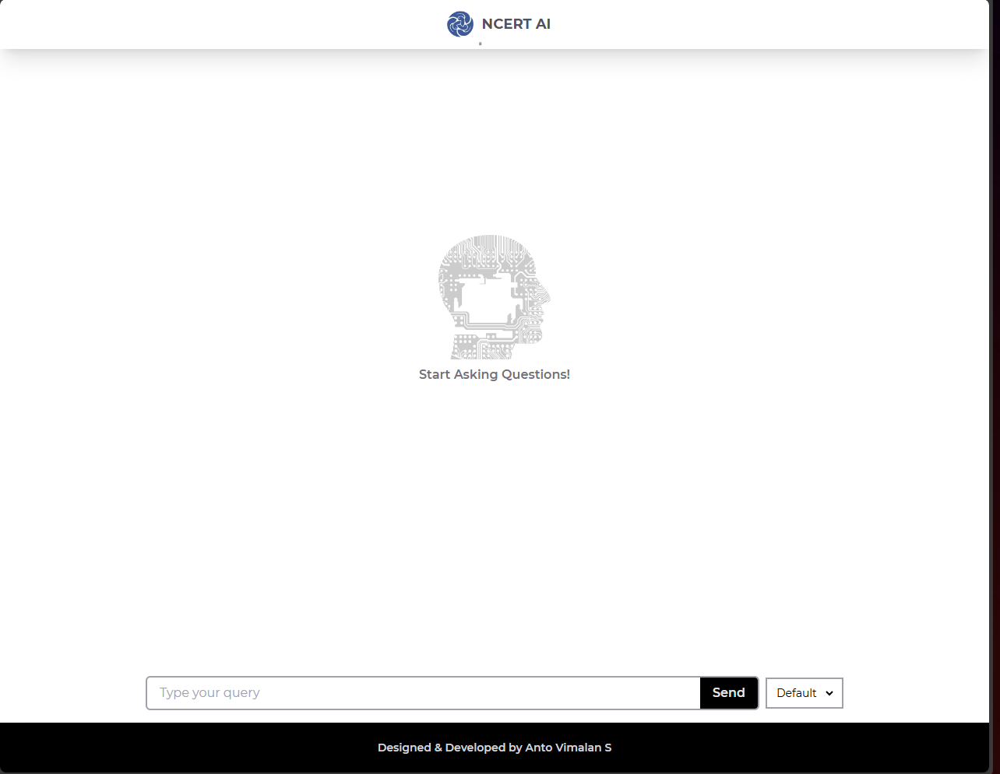
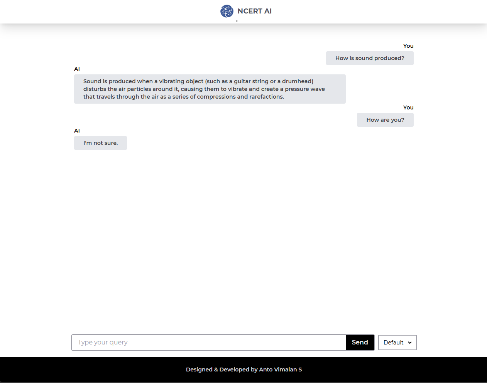
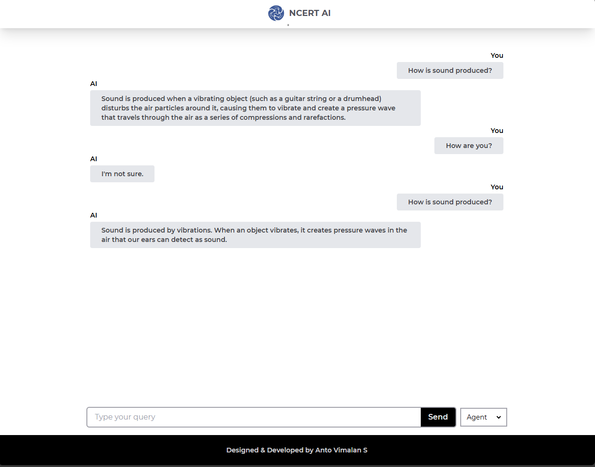

# NCERT AI

A webapp to get your doubts solved using AI (limited to NCERT book and Sound Chapter)

## Screenshots

### Home Page

### Default RAG

### RAG With Agent

## A bit about myself and thought process

Already Known: Frontend part  
Learned: FastAPI, RAG, Agent, LLM, Tool Calling etc.,

Basicaly I learned everything related to backend part of this project 

#### Step by Step Breakdown:

- Watched YouTube videos and blogs to understand RAG, LLM, Agents etc., 
- Implemented some examples to practically understand how it works
- After a good hold, started to break down the tasks
- Part 1: Converting PDF to text -> text to embeddings -> embeddings to store in vectorDB
- Part 2: Using RAG to query VectorDB and it's tuning
- Part 3: Using Agent and tool calling to query VectorDB  
- Part 4: Learned FastAPI and implemented it
- Part 5: Integrated Frontend with the Backend

## Tech Stack
- FrontEnd: React, Tailwind CSS, Vite
- Backend: FastAPI
- LLM: Groq Llama (As it is free)
- Vector DB: ChromaDB
- Embeddings: HuggingFace

## User Journey

1. If Default Option is selected it will perform querying VectorDB and returns the result

2. If Agent Option is selected it will use AI Agent and tool calling and returns the result

## Future Scope

- Adding more knowledge to LLM by adding diverse datasets in other subjects
- Adding memory to Agent
- Store history similar to ChatGPT and enable users to access from it
- Research more in this domain various models and their pro, cons, embedding methods, vectorDB etc.,

## Additional Features

- Generate Flash cards on the subject for quick revision
- Quiz section to test the knowledge 

## Steps to Run the Application

### Frontend
- Run "cd client" in terminal
- Run "npm run dev" in terminal

### Backend
- Run "cd server" in terminal
- Run "uvicorn app.main:app --reload" in terminal

#### Note: I didn't remove the API Key in .env to run it without much hassle 
